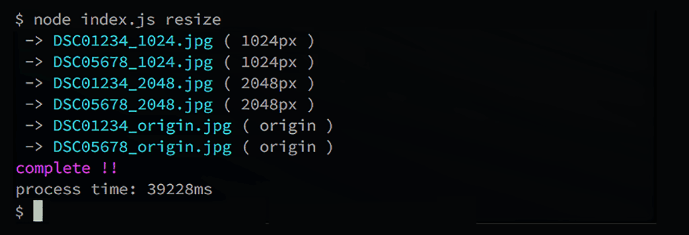
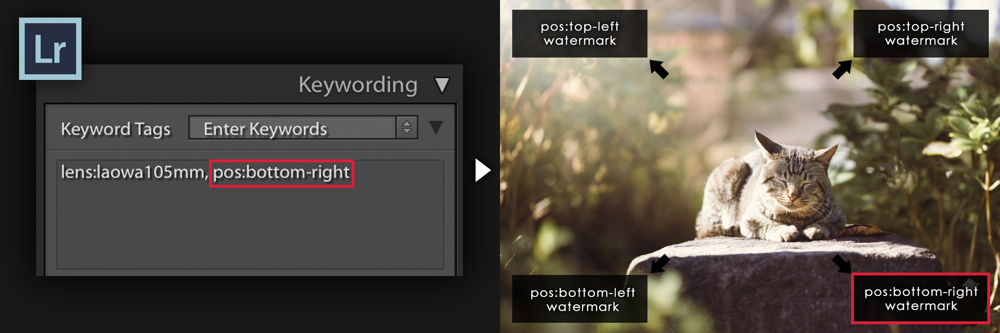
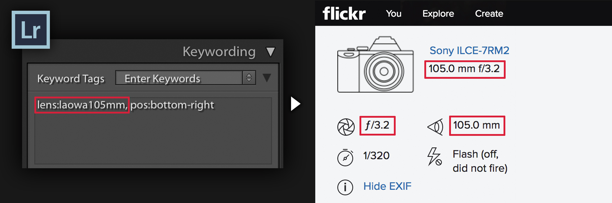

## Overview

This project efficiently help to process photo.

- resize image
- add watermark
- inputs Exif and IPTC titles and descriptions



## Document

- [Lightroomの後処理から数種類のリサイズと、ウォーターマークを一括処理するNode.jsを書いてみた](https://tea3.github.io/p/17/lightroom-resize-and-watermark-nodejs)

## Example of use

- [flickr photos](https://www.flickr.com/photos/masakazu-tea/33625299194/)
- [Other photos](https://www.flickr.com/photos/tags/tea81p)


### Install ImageMagick and ExifTool and Cairo

> Resizing images made easy - thanks to [ImageMagick](http://www.imagemagick.org/) and [ExifTool](http://www.sno.phy.queensu.ca/~phil/exiftool/) and [Cairo](https://cairographics.org/) .

Make sure ImageMagick and ExifTool and Cairo is installed on your system and properly set up in your `PATH`.

Ubuntu:

```shell
apt-get install imagemagick exiftool libcairo2-dev
```

Mac OS X (using [Homebrew](http://brew.sh/)):

```shell
brew install imagemagick --disable-openmp
brew install exiftool
brew install cairo --use-gcc
```

Windows & others:

- imagemagick : [http://www.imagemagick.org/script/binary-releases.php](http://www.imagemagick.org/script/binary-releases.php)
- exiftool : [http://www.sno.phy.queensu.ca/~phil/exiftool/](http://www.sno.phy.queensu.ca/~phil/exiftool/)
- cairo : [https://cairographics.org/download/](https://cairographics.org/download/)

Confirm that ImageMagick is properly set up by executing `convert -help` in a terminal.


## Install

Install with [git](https://git-scm.com/) and [npm](https://docs.npmjs.com/getting-started/installing-node)

```
git clone https://github.com/tea3/resize-and-watermark.git
cd resize-and-watermark
npm install
```

## Usage

For example, please create `_config.yml` as follows.

```
resizePix:                              # resize task option
  - 0                                   # no resize (original size)
  - 1024                                # resize images 1024 pixels
  - 2048                                # resize images 2048 pixels
# ignoreWatermark:                      # If you don't want to add watermark , enable option as following.
#   - 0
#   - 1024
readDir:                                # Folder name including image to resize
  - ./sample JPG/targetFolder
distDir: ./sample JPG/resizedFolder     # Path where you want to output the resized image
watermark: src/sample-watermark.png     # File path of watermark image
watermarkWidthRate : 0.1                # The size of the image occupied by the watermark
watermarkMarginRate: 0.02               # Watermark margin
# defaultWatermarkPosition:             # Default position of watermark
#   - North
#   - West
# watermarkColor: auto                  # Watermark Color Overlay (e.g. : auto , 00FFFF , FF00FF , FFFF00 , red , green , blue , ...)
# colorTiefQuality: 50                  # If watermarkColor is auto, determine the quality to calculate the color. ( 1: High Quality and very slow , 10: Normal Quality and slow , 50: Reasonable quality and fast )
# colorTiefQuality_watermarkArea: 1     #
# watermarkColorSelectionWeight:        # Criteria for choosing the color of the watermark
#   - 1.0                               # Hue difference
#   - 1.0                               # Saturation difference
#   - 4.0                               # Luminance difference
# defaultLens: lens:laowa105mm          # Lens keyword to enter when there is no Exif
# parallelLimit: 4                      # Max number of processes to be processed in parallel. The value is recommended about twice the number of CPUs.

quality: 97                             # JPEG quality value


fileTitle: My Picture                   # Always a character string to be included in the IPTC title meta field
constTag:                               # Always a character string to be included in the IPTC keywords meta field
  - photo
  - animal
  - etc
copyright: (c) your-name                # Always a character string to be included in the Exif copyright field
descriptionTemplate : desciption        # Always a character string to be included in the Exif desciption field
```

Then run node.js. Must install NodeJS from https://nodejs.org/ beforehand to launch with "node index.js"

```
$ node index.js resize
```

or

```
$ node index.js r
```

## Control with keywords and Exif

You can customize processing with with photo included keywords and exif. For example , how to include keywords, please see the following.

- [How to use keywords in Lightroom](https://helpx.adobe.com/lightroom/help/keywords.html)

### watermark position



You can customize the position of the watermark based on `pos:****-****` keywords .

| keywords to include in photos | watermark position |
| :---: | :---: |
| `pos:top-left` | NorthWest |
| `pos:top-right` | NorthEast |
| `pos:bottom-left` | SouthWest |
| `pos:bottom-right` | SouthEast |
| `pos:middle-center` | Center |

You can change keywords from Photoshop or [Lightroom]((https://helpx.adobe.com/lightroom/help/keywords.html)), but you can also change them with the following commands.

```
$ node index.js position bottom right image1.jpg image2.jpg ...
```


Also , you can customize position rule . if you want to customize , please edit `settings/watermarkPosition.json`.


### Manual input of lens information ( Exif and IPTC title )



When resizing, lens information can be entered automatically by keyword.

| keywords to include in photos | Input lens information ( Exif and IPTC ) |
| :---: | :---: |
| `lens:50mmf1.2s` | Ai Nikkor 50mm f/1.2S |
| `lens:laowa105mm` | LAOWA 105mm F2 Bokeh Dreamer STF |

You can change keywords from Photoshop or [Lightroom]((https://helpx.adobe.com/lightroom/help/keywords.html)), but you can also change them with the following commands.

```
$ node index.js lens laowa105mm image1.jpg image2.jpg ...
```


 Also , you can customize lens rule . if you want to customize , please edit `settings/cameraLens.json`.


## Using Export Actions in Adobe Lightroom

For example, if you want to use Lightroom's Export Action, please describe Apple Script in Automator as follows.

```
function run(input, parameters) {
  
  var cdm = "cd \"$HOME/Desktop/your-cloned-dir/resize-and-watermark\"";
  var nvm = "nvm use 4.3.0";

  var Terminal = Application('Terminal')
  Terminal.activate()
  var terW1 = Terminal.windows[0]
  try{
    console.log(terW1.selectedTab.properties())
  }catch(e){
    Terminal.doScript("echo 'Hi terminal window 1'");
    terW1 = Terminal.windows[0]
  }
  waitDelay(terW1)

  Terminal.doScript( cdm , {in: terW1} )
  waitDelay(terW1)
  Terminal.doScript( nvm , {in: terW1} )
  waitDelay(terW1)
  Terminal.doScript( "node index.js resize" , {in: terW1} )
  waitDelay(terW1)
  
    return input;
}

function waitDelay(inTerminalWindow){
  delay(1)
  while( inTerminalWindow.selectedTab.busy() ){
    delay(1)
  }
}
```